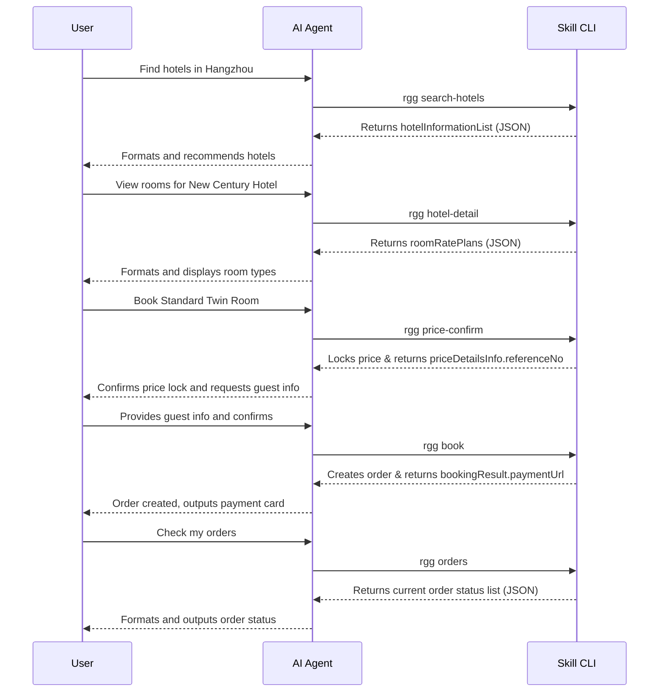

# RollingGo Hotel Skill

```text
  ██████╗  ██████╗ ██╗     ██╗     ██╗███╗   ██╗ ██████╗  ██████╗  ██████╗ 
  ██╔══██╗██╔═══██╗██║     ██║     ██║████╗  ██║██╔════╝ ██╔════╝ ██╔═══██╗
  ██████╔╝██║   ██║██║     ██║     ██║██╔██╗ ██║██║  ███╗██║  ███╗██║   ██║
  ██╔══██╗██║   ██║██║     ██║     ██║██║╚██╗██║██║   ██║██║   ██║██║   ██║
  ██║  ██║╚██████╔╝███████╗███████╗██║██║ ╚████║╚██████╔╝╚██████╔╝╚██████╔╝
  ╚═╝  ╚═╝ ╚═════╝ ╚══════╝╚══════╝╚═╝╚═╝  ╚═══╝ ╚═════╝  ╚═════╝  ╚═════╝ 
            ██╗  ██╗ ██████╗ ████████╗███████╗██╗     
            ██║  ██║██╔═══██╗╚══██╔══╝██╔════╝██║     
            ███████║██║   ██║   ██║   █████╗  ██║     
            ██╔══██║██║   ██║   ██║   ██╔══╝  ██║     
            ██║  ██║╚██████╔╝   ██║   ███████╗███████╗
            ╚═╝  ╚═╝ ╚═════╝    ╚═╝   ╚══════╝╚══════╝
            
  ──●────●────●────●────●────●──
   AI Skills for Claude • Cursor • Copilot
```

Search → Recommend → Price Confirm → Book → Orders Check


---

Just say to your Agent: "I'm traveling to XX, help me book a hotel."

The RollingGo Hotel Booking Skill handles the entire process for you:

🔍 **Smart Filtering**: Automatically picks the best hotels based on your needs.

📋 **Real-time Checks**: Live room types, pricing, and cancellation policies—no hidden traps.

🛏️ **Early Lock-in**: Lock your favorite room instantly.

🔐 **Secure Login**: One-click secure OAuth login directly within the Agent, protecting your privacy.

💳 **Direct Payment**: pay by credit card.

📑 **Order Tracking**: Check your order status anytime.

💴 **Price Monitoring**: Set up 24-hour automatic price tracking and get instant alerts if prices drop.

No more manual price comparisons or worrying about booking too early or too late. Hand over your hotel booking headaches with just one sentence.

## ✨ Skill Highlights

- ✅ **Agent-Native Interaction**: Designed natively for Agents, completing the entire booking flow via natural conversation.
- ✅ **Real-time Inventory & Price Confirmation**: Direct connection to inventory + live price confirmation. Zero-latency information ensures all search results are immediately bookable.
- ✅ **Mature Supply Chain Guarantee**: Backed by the world's 3rd largest travel B2B official data source, with 14 years of supply chain accumulation and full-link API direct connections.
- ✅ **Massive Hotel Coverage**: Access to over 2 million hotel resources, covering global destinations.
- ✅ **Directly Contracted Resources**: 110,000+ directly contracted hotels with real-time price and inventory response.
- ✅ **Diverse Supply System**: Integrates 500+ global suppliers covering all types of hotel brands to meet varied booking needs.
- ✅ **Differentiated Price Advantage**: Anchored to upstream OTA supply, featuring significant price advantages.
- ✅ **Broad Compatibility**: Supports 40+ mainstream AI agents including Cursor, Claude Code, Codex, Windsurf, and Copilot.
  


## ✨ Installation
### Method 1: Directly Tell Your Agent (Recommended)
```
Install this skill for me: https://github.com/RollingGo-AI/hotel-skill-global
```
Choose this installation method if you prefer a hassle-free, fully visual workflow.

### Method 2: Via npx skills
Automatically compatible with Cursor, Claude Code, Windsurf, and 40+ other agents.Use this installation method for development & operations scenarios requiring precise module control and frequent switching between multiple tools.

```bash
# Interactive installation (Recommended, freely select capability modules from the menu)
npx skills add https://github.com/RollingGo-AI/hotel-skill-global

# Or directly install a specific core module (Skips interactive menu)
npx skills add https://github.com/RollingGo-AI/hotel-skill-global --skill hotel-core
```

The CLI auto-detects the agent installed on your system. You can also explicitly target an environment via `--agent`:

```bash
npx skills add https://github.com/RollingGo-AI/hotel-skill-global --agent cursor
```

### Method 3: Manual Clone/Copy

Clone this repository and drop the `skills/hotel-core/` folder directly into your Agent's respective skills directory:

| Agent | Local Skill Directory |
|-------|-----------------|
| Claude Code | `~/.claude/skills/` |
| Cursor | `~/.cursor/skills/` |
| OpenAI Codex | `~/.codex/skills/` |
| Windsurf | `~/.windsurf/skills/` |
| Google Antigravity | `~/.gemini/antigravity/skills/` |

### 📕Core Capabilities List
| Command | Description |
|-------|-------------|
| **`rgg login`** | OAuth 2.1 PKCE passwordless secure authorization |
| **`rgg search-hotels`** | Multi-dimensional hotel search by landmarks, dates, and tags |
| **`rgg hotel-detail`** | Fetch live room types, latest quotes, and cancellation policies |
| **`rgg price-confirm`** | Lock room price and generate transaction `referenceNo` |
| **`rgg book`** | Submit guest info and return the actual payment link |
| **`rgg orders`** | View historical orders and latest payment status |

### LLM Standard Operating Procedure (SOP)
The canonical workflow sequence that AI should suggest or execute automatically:

```bash
# 1. First, check the user's login status
rgg whoami
# -> If "Not logged in", prompt the user to run `rgg login` first

# 2. Search for desired hotels (e.g., Shanghai hotels next week)
rgg search-hotels --place "Shanghai" --check-in-date 2026-06-20

# 3. Present the search results to the user in Markdown. Once they pick one, fetch details:
rgg hotel-detail --hotel-id 12345 --check-in-date 2026-06-20

# 4. After the user confirms the room type, lock the price (HIGH RISK step, user confirmation mandatory!)
rgg price-confirm --hotel-id 12345 --rate-plan-id "RP01" --rooms 1 --check-in-date 2026-06-20 --check-out-date 2026-06-21 --adults 2

# 5. After the user approves the locked price and provides their name, place the final order:
rgg book --reference-no "REF9999" --first-name "San" --last-name "Zhang"
```

---
## ✨ Live Demo

The following demonstrates the complete dialogue and terminal command execution flow when running this Skill via AI agents like Claude Code or Cursor. You do not need to understand any command-line parameters; the AI agent will automatically recognize your natural language intent and invoke the `rgg` CLI tool.

### 2.1 State Requirements

```
User: I'm going on a business trip to Hangzhou next Saturday (June 20). Help me find a 5-star New Century hotel in Hangzhou for 2 people for 1 night.
```

The AI agent executes the hotel search in the background:

```bash
$ rgg search-hotels --origin-query "5-star New Century hotel in Hangzhou, 2 people for 1 night" --place "Hangzhou" --place-type "city" --check-in-date 2026-06-20 --stay-nights 1 --star-ratings 5 --size 3
```

Terminal output:
```json
{
  "success": true,
  "hotelInformationList": [
    {
      "hotelId": 1090005,
      "bookingUrl": "https://rollinggo.cn/xxxx",
      "name": "Grand New Century Hotel Fuyang",
      "brand": "Delonix",
      "address": "No. 61 North Jinqiao Road, Fuchun Street",
      "destinationId": "6084457",
      "latitude": 30.049471,
      "longitude": 119.933616,
      "starRating": 5,
      "price": {
        "message": "Price check successful. Lowest price: 352, Currency: CNY",
        "hasPrice": true,
        "currency": "CNY",
        "lowestPrice": 352
      },
      "areaCode": "CN",
      "description": "<p><b>Hotel Description</b><br/>Located in the CBD of Fuyang District...</p>",
      "imageUrl": "https://image2-cdn.aigohotel.com/3/Image/1090005/0221d1200084a0cdf79B1_R_550_412.jpg-agh",
      "hotelAmenities": ["Gym", "Indoor Heated Pool", "Lobby Bar", "WIFI"],
      "tags": ["5-Star Hotel", "Gym", "Free WiFi", "Free Parking"],
      "nameEn": "Grand New Century Hotel Fuyang"
    }
  ]
}
```

The AI agent formats the data and replies:

```
AI Assistant: I found the following 5-star New Century hotel in Hangzhou that matches your request:

🏨 Grand New Century Hotel Fuyang
⭐ 5.0 Stars  📍 Located in Fuyang CBD, next to the subway station
💰 Reference Price: $352/night (CNY)
🏷️ 5-Star Hotel · Gym · Free WiFi · Free Parking
🔗 [View Details & Book](https://rollinggo.cn/xxxx)

Would you like to see detailed room types and pricing for this hotel?
```

---

### 2.2 Select Hotel, View Room Types

```
User: Yes, let's see what room types are available here.
```

The AI agent automatically calls the API to fetch live room types and prices:

```bash
$ rgg hotel-detail --hotel-id 1090005 --check-in-date 2026-06-20 --check-out-date 2026-06-21 --room-count 1 --adult-count 2
```

Terminal output:
```json
{
  "success": true,
  "hotelId": 1090005,
  "bookingUrl": "https://rollinggo.cn/xxxx",
  "name": "Grand New Century Hotel Fuyang",
  "checkIn": "2026-06-20",
  "checkOut": "2026-06-21",
  "roomRatePlans": [
    {
      "roomTypeId": 22724870,
      "roomName": "Standard Twin Room",
      "roomNameCn": "普通双床房",
      "ratePlanId": "6sQgUxvnJoG-bzLZRIVAeUw",
      "ratePlanName": "Standard Twin Room",
      "bedType": 5,
      "bedTypeDescription": "2 Single Beds",
      "currency": "USD",
      "totalPrice": 52,
      "isOnRequest": false,
      "cancellationPolicies": [
        {
          "fromDate": "2026-06-19T00:00:00+08:00",
          "amount": 52
        }
      ]
    }
  ],
  "message": "Search successful",
  "nameEn": "Grand New Century Hotel Fuyang"
}
```

The AI agent presents the formatted details:

```
AI Assistant: Here are the room details for the Grand New Century Hotel Fuyang:

🛏️ Standard Twin Room (2 Single Beds)
💰 Total Price: $52 (USD) ($52/night)  Availability: Ample
📋 Cancellation Policy: Cancellations after June 19, 2026, incur a full-amount penalty (No free cancellation).

Let me know if you would like to book this room type.
```

---

### 2.3 Confirm Room Type & Lock Price

```
User: Let's book the Standard Twin Room.
```

The AI agent calls the `price-confirm` command in the background to lock the price and get the transaction reference number:

```bash
$ rgg price-confirm --hotel-id 1090005 --rate-plan-id "6sQgUxvnJoG-bzLZRIVAeUw" --rooms 1 --check-in-date 2026-06-20 --check-out-date 2026-06-21 --adults 2
```

Terminal output:
```json
{
  "success": true,
  "message": "Price confirm success",
  "priceDetailsInfo": {
    "referenceNo": "17815407901",
    "checkInDate": "2026-06-20 00:00:00",
    "checkOutDate": "2026-06-21 00:00:00",
    "hotelList": [
      {
        "hotelName": "Grand New Century Hotel Fuyang",
        "totalPrice": 352,
        "referenceTotalPrice": 402,
        "ratePlanList": [
          {
            "roomName": "Standard Twin Room",
            "bedType": 52,
            "currency": "CNY",
            "totalPrice": 352,
            "averagePrice": 352,
            "isOnRequest": false
          }
        ],
        "cancellationPolicyList": [
          {
            "fromDate": "2026-06-19T00:00:00+08:00",
            "amount": 52
          }
        ]
      }
    ]
  }
}
```

The AI agent prompts the user for secondary confirmation (Security Gates mechanism):

```
AI Assistant: ✅ Price and room availability have been locked!

Hotel: Grand New Century Hotel Fuyang
Room: Standard Twin Room
Dates: 2026-06-20 → 2026-06-21 (1 Night)
Total Price: $52 USD(Taxes included)
Cancellation Policy: Free cancellation before June 19, 2026. After this date, a penalty of $52 applies.
⏰ Lock Validity: 30 minutes

Do you confirm this booking? If yes, please provide the guest's name (First Name and Last Name in Pinyin or English).
```

> [!WARNING] Lock Validity
> The price lock is valid for about 30 minutes. If the user hesitates for too long, the AI agent will automatically trigger the price lock again before finalizing the order to prevent timeout failures.

---

### 2.4 Finalize Order & Get Payment Link

```
User: Confirmed, guest is ZHANG SAN.
```

The AI agent invokes the `book` command to generate the final order and retrieve the payment link:

```bash
$ rgg book --reference-no "17815407901" --first-name "SAN" --last-name "ZHANG"
```

Terminal output:
```json
{
  "success": true,
  "bookingResult": {
    "orderNo": "H178168930177922821",
    "paymentType": "URL",
    "paymentUrl": "https://rollinggo.cn/xxxx"
  }
}
```

The AI agent presents the payment card:

```
AI Assistant: 🎉 Booking successful! Your order has been created.

Confirmation No: **H178168930177922821**
Hotel: Grand New Century Hotel Fuyang
Room: Standard Twin Room
Check-in: 2026-06-20 | Check-out: 2026-06-21
Total Price: $52 USD

💳 Please click the link below to complete your payment within 30 minutes:
[Click Here to Complete Payment](https://rollinggo.cn/xxxx)

Once paid, you can say "check my orders" to verify the status at any time.
```

---

### 2.5 Check Orders

```
User: My orders
```

The AI agent queries the account's order list:

```bash
$ rgg orders
```

Terminal output:
```json
[
  {
    "hotelBookingInfo": {
      "referenceNo": "17815407901",
      "status": "3",
      "checkInDate": "2026-06-20T00:00:00.000",
      "checkOutDate": "2026-06-21T00:00:00.000",
      "numOfRooms": 1,
      "nights": 1,
      "totalPrice": 352,
      "mainOrderNo": "M17816893017792282",
      "subOrderNo": "H178168930177922821",
      "language": "en",
      "channel": "AI_LAB",
      "partner": "rollinggo",
      "priceConfirmTime": "2026-06-17T17:41:28.000"
    },
    "hotelBookingHotel": {
      "hotelId": 1090005,
      "hotelName": "Grand New Century Hotel Fuyang",
      "hotelAddress": "No. 61 North Jinqiao Road, Fuchun Street",
      "hotelPhone": "0571-63287888",
      "starRating": "5.0",
      "image": "https://image2-cdn.aigohotel.com/...",
      "timezone": "Asia/Shanghai",
      "checkInFrom": "15:00:00",
      "checkOutTo": "12:00:00",
      "cityCode": "6084457"
    },
    "hotelContact": {
      "firstName": "SAN",
      "lastName": "ZHANG",
      "phone": "+86-19189734356"
    },
    "hotelGuestList": [
      {
        "roomNum": 1,
        "firstName": "SAN",
        "lastName": "ZHANG",
        "isAdult": true
      }
    ],
    "hotelRatePlanInfo": {
      "hotelId": 1090005,
      "roomNum": 1,
      "adultCount": 2,
      "childCount": 0,
      "roomTypeId": 22724870,
      "roomName": "Standard Twin Room",
      "ratePlanId": "6sQgUxvnJoG-bzLZRIVAeUw",
      "ratePlanName": "Standard Twin Room",
      "bedType": 5,
      "currency": "CNY",
      "totalPrice": 352,
      "averagePrice": 352,
      "isOnRequest": false,
      "hasWifi": true
    },
    "hotelDailyPriceList": [
      {
        "price": 352,
        "stayDate": "2026-06-20T00:00:00.000",
        "mealType": 1,
        "mealAmount": 0
      }
    ],
    "hotelCancellationPolicyList": [
      {
        "fromDate": "2026-06-19T00:00:00.000",
        "fromDateLocal": "2026-06-19T00:00:00.000",
        "amount": 352
      }
    ],
    "currentTimeBeijing": "2026-06-17T17:41:48.146"
  }
]
```

The AI agent replies:

```
AI Assistant: You currently have 1 active hotel order:

🏨 Grand New Century Hotel Fuyang
🛏️ Standard Twin Room · 1 Room · 1 Night
📅 Check-in: 2026-06-20 to 2026-06-21
👤 Guest: ZHANG SAN
💰 Total: $352 CNY
Status: Created / Pending Payment (Status: 3)

If you need to pay, you can click the previous payment link. If you need details on cancellations, please let me know.
```

---

### 2.6 Full Sequence Diagram



---

### Risk Level
**MODERATE** — Can trigger real-world hotel reservations. The skill enforces a strict two-step confirmation gate before making any `book` calls.

Official AI skills specifically tailored for the **RollingGo Hotel CLI** (`@rollinggo/hotel-global`). It teaches various AI agents the correct hotel booking workflow, OAuth 2.1 PKCE login flow, and how to safely trigger real-world hotel transactions directly from the terminal. Compatible with the [skills CLI](https://github.com/vercel-labs/skills) spec.

Prompt for AI Agents: When the user asks to **book a hotel**, **check availability**, or **view orders**, use the `rgg` commands in sequence. Never leak raw internal system IDs like `hotelId` or `referenceNo` to the user; format results into beautiful Markdown cards.

> **Security Warning**: This tool connects directly to real-world transaction systems. The skill library enforces a strict "hard rule" on AI agents: **Under no circumstances is an order to be initiated without explicit user confirmation of the price and intent to pay.**

---

## Structure / Architecture
```text
RollingGo-Skills/
  ├── README.md               # Main orchestrator and SEO entry
  ├── AGENTS.md               # Directives for AI web crawlers
  ├── .github/
  │    └── copilot-instructions.md
  └── skills/
       ├── llms.txt           # AI Index for search engines
       └── hotel-core/        # Core hotel booking skill
            ├── SKILL.md
            └── references/
                 └── cli-params.md
```

## License
MIT
